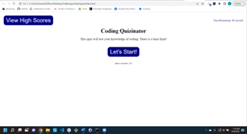

# Quiztopia

## User Story

- As a coding boot camp student, I want to take a timed quiz on JavaScript fundamentals that stores high scores so that I can gauge my progress compared to my peers.

## Acceptance Criteria

- When I click the start button, then a timer starts and I am presented with a question
- When I answer a question, then I am presented with another question
- When I answer a question incorrectly, then time is subtracted from the clock
- When all questions are answered or the timer reaches 0, then the game is over
- When the game is over, then I can save my initials and score

## Repository Link

- Repository can be found at:
  [GitHub](https://github.com/susangrace909/Quiztopia.git)
  [Live](https://susangrace909.github.io/Quiztopia/)

## Screenshot:

